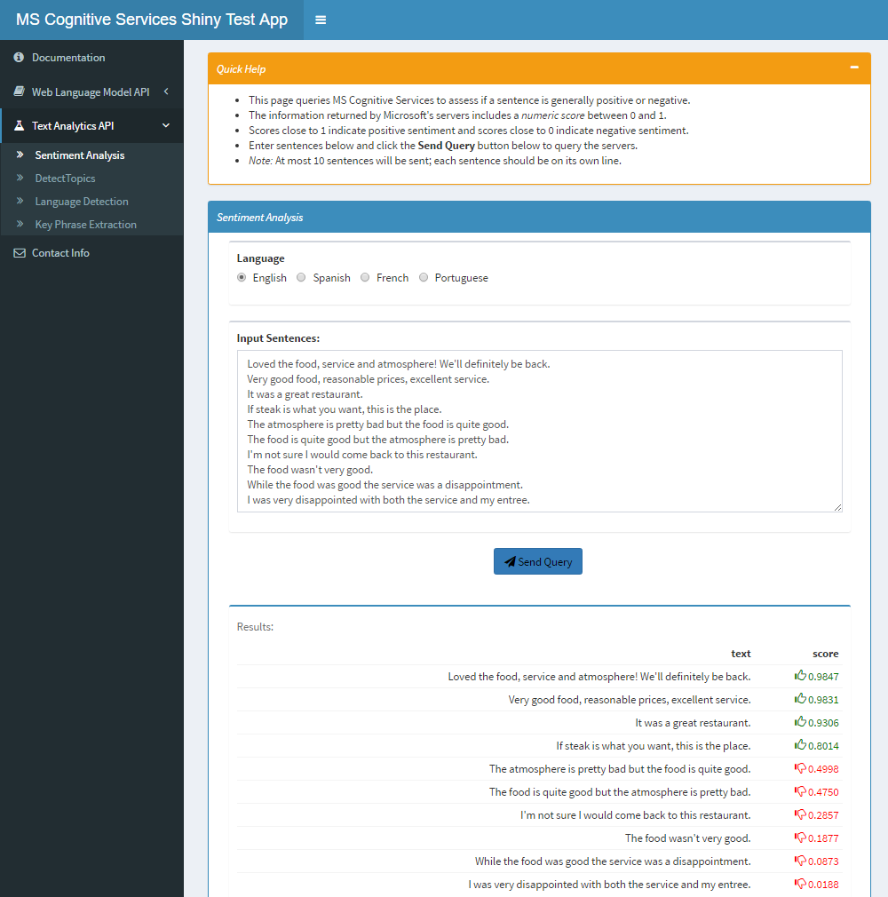
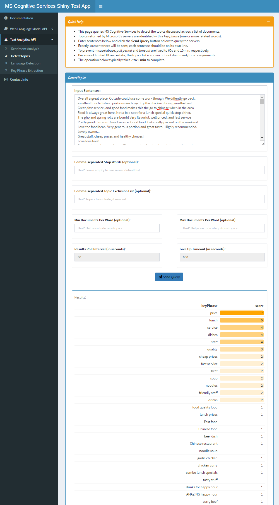
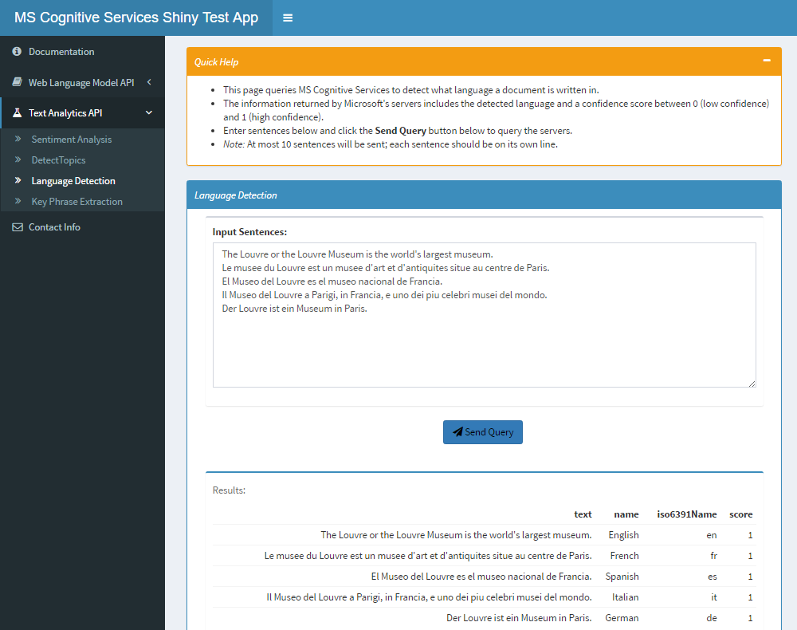
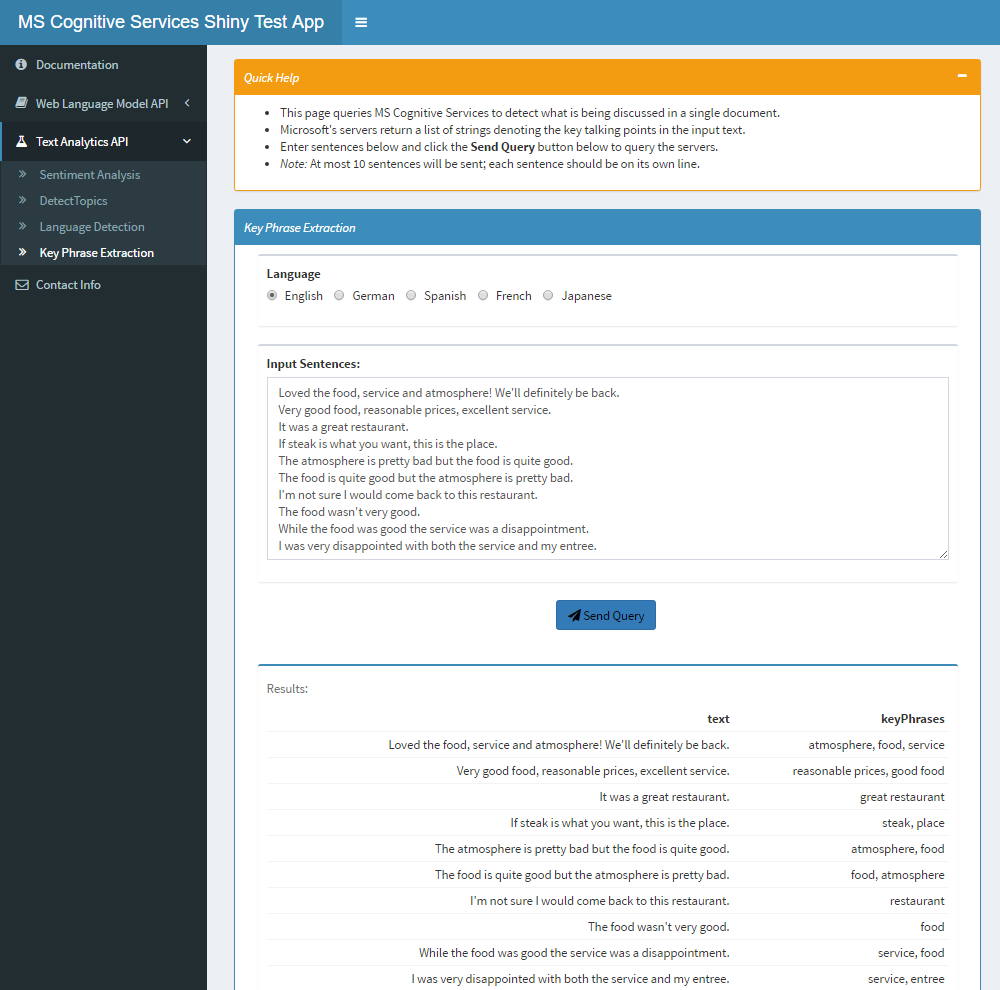

# Welcome to MSCSShiny!
Phil Ferriere  
June 2016  

**MSCSShiny** is a test/demo application for R packages like `{mscstexta4r}` and `{mscsweblm4r}` that interface with the Microsoft Cognitive Services REST APIs.

## Microsoft Cognitive Services? What's that about?

[Microsoft Cognitive Services](https://www.microsoft.com/cognitive-services/en-us/documentation)
-- formerly known as Project Oxford -- are a set of large, diverse, truly awesome APIs, SDKs and services that developers can use to add [AI](https://en.wikipedia.org/wiki/Artificial_intelligence) features to their apps. Those features include emotion and video detection; facial, speech and vision recognition; as well as speech and [NLP](https://en.wikipedia.org/wiki/Natural_language_processing).

## MSCS Language Services

Our interest, at this stage, is limited to the exploration and evaluation of the NLP features of MSCS:

As should be clear from the above, this subset itself isn't exactly small...

## Text Analytics API

The `{mscstexta4r}` package is a wrapper around the MSCS [Text Analytics REST API](https://www.microsoft.com/cognitive-services/en-us/text-analytics/documentation). This API offers a suite of text analytics web services - built with Azure Machine Learning - that can be used to analyze unstructured text. The API supports the following operations:

* Sentiment analysis - Is a sentence or document generally positive or negative?
* Topic detection - What's being discussed across a list of documents/reviews/articles?
* Language detection - What language is a document written in?
* Key talking points extraction - What's being discussed in a single document?

For more information about the `{mscstexta4r}` package (on [CRAN](https://cran.r-project.org/package=mscstexta4r), or on [GitHub](https://github.com/philferriere/mscstexta4r)), please check out the **Text Analytics API** tab at the top of this page.

## Web Language Model API

The `{mscsweblm4r}` R package exposes bindings for the MSCS [Web Language Model REST API](https://www.microsoft.com/cognitive-services/en-us/web-language-model-api/documentation). Per Microsoft's website, this API uses smoothed backoff N-gram language models (supporting Markov order up to 5) that were trained on four web-scale American English corpora collected by Bing (web page body, title, anchor and query). The following operations are supported:

* Calculate the joint probability that a sequence of words will appear together.
* Compute the conditional probability that a specific word will follow an existing sequence of words.
* Get the list of words (completions) most likely to follow a given sequence of words.
* Insert spaces into a string of words adjoined together without any spaces (hashtags, URLs, etc.).
* Retrieve the list of supported language models.

For additional information on the `{mscsweblm4r}` package (on [CRAN](https://cran.r-project.org/package=mscsweblm4r), or on [GitHub](https://github.com/philferriere/mscsweblm4r)), please click the **Web Language Model API** tab at the top of this page.

## Text Analytics Screenshots

### Sentiment analysis

### Topic detection

### Language detection

### Key talking points extraction

## Web Language Model Screenshots

### Supported web language models

### Words most likely to follow a sequence of words

### Break concatenated words into individual words

### Conditional probability that a particular word follows a given sequence of words

### Joint probability that a particular sequence of words appears together

## Credits

All Microsoft Cognitive Services components are Copyright (c) Microsoft.

Customized progress bar style, courtesy of [\@jackolney](https://github.com/jackolney).

## Meta

Please report any MSCSShiny issues or bugs [here](https://github.com/philferriere/mscsshiny/issues).

License: MIT + [file](./LICENSE)

This project is released with a [Contributor Code of Conduct](./CONDUCT.md). By
 participating in this project, you agree to abide by its terms.

